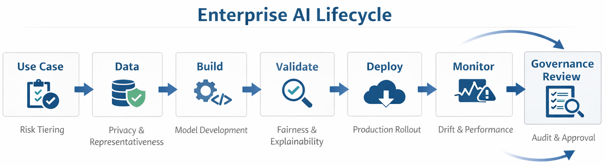

# Enterprise AI Governance Portfolio

Enterprise AI strategy, governance, and responsible AI case studies demonstrating lifecycle oversight and scalable implementation in regulated environments.

This portfolio highlights applied AI initiatives with emphasis on:

- AI lifecycle governance  
- Bias detection and fairness assessment  
- Deployment readiness and risk mitigation  
- Cloud-based scalable implementation  
- Human-in-the-loop oversight  
- Cross-functional stakeholder alignment  

The focus is on enabling responsible, explainable, and business-aligned AI adoption across enterprise systems — including workforce-facing platforms such as HR technology environments.

---

## Featured Case Studies

### 🔹 AI-Powered Document Intelligence & Workflow Automation  
Designed and deployed AWS-based AI pipelines leveraging LLMs and structured extraction to improve large-scale review workflows.

**Impact Highlights**
- ~40% improvement in review efficiency  
- ~70% reduction in manual summarization effort  
- Governance-aware implementation with validation checkpoints  

👉 [View Case Study](case-study-document-intelligence/)

---

### 🔹 Synthetic Data Quality & Bias Evaluation Framework  
Developed evaluation workflows to assess fairness, demographic representation, and statistical robustness in synthetic data systems.

**Focus Areas**
- Bias detection methodologies  
- Distributional shift monitoring  
- Responsible AI validation protocols  

👉 [View Case Study](case-study-synthetic-bias/)

---

## Governance Framework

A structured lifecycle oversight model guiding AI qualification, validation, deployment, and monitoring.

- Risk-tiered review checkpoints  
- Data governance and bias assessment  
- Model validation and documentation standards  
- Continuous monitoring and drift detection  
- Workforce and ethical impact safeguards  

👉 [View Governance Framework](governance-framework/)

## AI Lifecycle Overview

---

## Core Principles

- Responsible AI by design  
- Human accountability remains central  
- Transparent documentation and auditability  
- Continuous evaluation and improvement  
- AI systems positioned as decision-support, not opaque automation  

---

## Professional Focus

My current focus is on advancing enterprise AI governance and scalable implementation frameworks that enable ethical, transparent, and high-impact AI adoption across functional domains.

This includes workforce-facing AI systems where fairness, trust, and explainability are essential.
Selected enterprise AI initiatives demonstrating strategy, lifecycle oversight, and responsible AI implementation across regulated environments.
